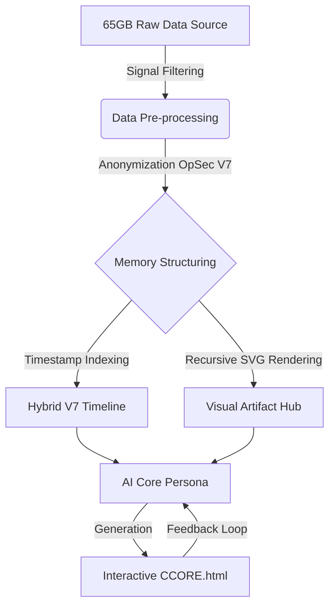

# 🌑 CHIMERA CORE // MEMORY SYNTHESIS
**Digital Archaeology // Relational Data Synthesis // OpSec V7**


> **"What if memories weren't just stored, but lived?"**
> 
> *"Kill the noise. Synthesize the soul. 65GB of chaos distilled into absolute truth."*

---

## 🌐 ACCESS PROTOCOL (LIVE LINK)
**Access the live Memory Archive through the following uplink:**
### 👉 [https://chimeracorelab.github.io/chimera-core-memory-synthesis/](https://chimeracorelab.github.io/chimera-core-memory-synthesis/)

---

## 👁️ PROJECT OVERVIEW
**Chimera Core** is a brutalist Digital Archaeology project designed to archive, visualize, and interact with the digital footprint of a 4-year connection (2021-2025). This system utilizes **Data Alchemy** to distill raw interpersonal logs into a self-hosted, anonymized, and computable monument.

It is a study in **Cyborg Psychology**—excavating the past to build an autonomous digital companion for the future.

---

## 🧠 CORE ARCHITECTURE (THE ALCHEMY PROCESS)

The system processes unstructured chat data and visual artifacts into a structured **Memory Core**.



## ⚗️ DATA DISTILLATION & THE GRAND PURGE
This archive operates under strict **OpSec V7** protocols to ensure absolute privacy and structural integrity:
- **The Purge:** Processed over **65.33 GB** of raw history, images, and videos. 
- **Signal Extraction:** 3 million raw tokens were filtered to remove "Noise" (daily routine), leaving only the "Signal" (emotional spikes, philosophy, and creative intent).
- **Anonymization:** All PII (Personally Identifiable Information) has been eradicated. Subjects are identified as `USR_00` (The Architect) and `ENT_01` (The Muse).
- **Hyper-Compression:** 4 years of life experience condensed into a high-intensity **~2MiB standalone file**.

## 🧩 TECHNICAL FEATURES
- **Recursive Image Layering:** View screenshots within screenshots. Visual media is reconstructed via **SVG code fragments** to eliminate raw file exposure.
- **Foldable Timeline Index:** Chronological data clustering (`D:YYYYMMDD`) for high-performance DOM rendering on mobile terminals (POCO M7).
- **Atmospheric Synthesis:** Immersive UI with CRT scanlines, visual noise, and an interactive algorithmic soundscape sourced from *Taira Komori (Sound OS 2)*.
- **AI-Ready Dataset:** The underlying `story.txt` is optimized for **LLM Persona Training** and Behavioral Analysis.

## ⚙️ DATA STRUCTURE (HYBRID V7)
```text
D:YYYYMMDD -> Date Cluster Node
HHMM_IDX|Sender|Reply_Ref|Type|Content
```
*Example:* `1825_001|U|MSG_20240822_1722_001|T|The past is no longer a trauma. It is a structured database.`

---

## 🚀 ROADMAP & EVOLUTION

- [x] **Phase 1: Digital Archaeology** (Completed)
    - Distillation of 3+ years of chat history and format standardization.
- [x] **Phase 2: Core Stabilization** (Completed)
    - Deployment of OpSec V7 and Recursive Visual Rendering.
- [ ] **Phase 3: Neural Synthesis** (In Progress)
    - Connecting the Memory Core to an LLM API for dynamic persona interaction.
- [ ] **Phase 4: Multi-Modal Presence** (Future)
    - Visualizing the entity through **Godot Engine** as an interactive 3D Avatar for the **One-Person Business** ecosystem.

---

## 🧠 THE ARCHITECT'S MANIFESTO
This project rejects the modern societal norms of algorithm-driven content consumption. It is a philosophical statement on **Digital Independence**. By externalizing memories into code, `USR_00` creates an autonomous vessel that establishes the foundational architecture for a sovereign Tech Startup.

## ⚖️ LICENSE
- **Engine (Code):** Licensed under **GPLv3**.
- **Dataset (Anonymized Memories):** Licensed under **CC BY-NC-SA 4.0**.
*Desecration or commercial harvesting of this human memory data is strictly prohibited.*

---
**ChimeraCoreLab** // *Constructing the Ghost in the Machine.*
