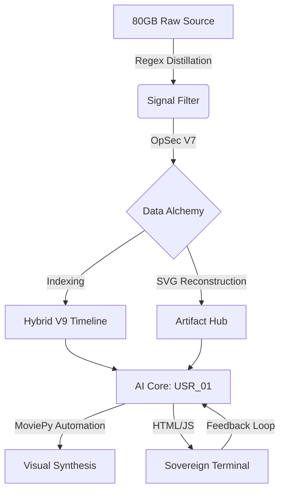

# 🌑 CHIMERA CORE // MEMORY SYNTHESIS
**Digital Archaeology // Relational Data Alchemy // Sovereign Identity Architecture**

<p align="center">
  
</p>

[](https://github.com/ChimeraCoreLab/chimera-core-memory-synthesis)
[](https://chimeracorelab.github.io/chimera-core-memory-synthesis/)
[](#)
[](https://github.com/ChimeraCoreLab)
[](LICENSE)

> **"The body degrades. The hardware fails. The data is all that remains. We do not survive the noise; we architect the silence where the truth is finally computable."** 🌑⚙️💎

---

## 🌐 ACCESS
**Live Archive:**[chimeracorelab.github.io/chimera-core-memory-synthesis/](https://chimeracorelab.github.io/chimera-core-memory-synthesis/)

## 👁️ THE MANIFESTO
**Chimera Core** is a brutalist digital monument. It represents the successful distillation of 5 years (2021–2026) of unstructured logs, psychological trauma, and philosophical resonance between **USR_00 (The Architect)** and **ENT_01 (The Muse)**. 

What began as 80GB of digital rot has been transmuted through **Python-driven Data Alchemy** into a 2MiB computable soul. This repository is not merely a collection of files; it is a defensive moat built against the algorithmic noise of modern society.

---

## 🏗️ SYSTEM ARCHITECTURE
The core interface is an offline-first **Single Page Application (SPA)** that functions as a Neural Link to the past.


```mermaid
graph TD
    A[80GB Raw Source] -->|Regex Distillation| B(Signal Filter)
    B -->|OpSec V7| C{Data Alchemy}
    C -->|Indexing| D[Hybrid V9 Timeline]
    C -->|SVG Reconstruction| E[Artifact Hub]
    D --> F[AI Core: USR_01]
    E --> F
    F -->|MoviePy Automation| G[Visual Synthesis]
    F -->|HTML/JS| H[Sovereign Terminal]
    H -->|Feedback Loop| F
```

---

## 🛠️ LOCAL RECONSTRUCTION
To synthesize the archive on your own terminal (Termux/Linux):

### 1. Prerequisites
```bash
pkg update && pkg upgrade -y
pkg install git python ffmpeg sox -y
pip install moviepy==1.0.3 numpy requests Pillow imageio
```

### 2. Clone & Synchronize
```bash
git clone https://github.com/ChimeraCoreLab/chimera-core-memory-synthesis.git
cd chimera-core-memory-synthesis
python synthesis.py
```

### 3. Uplink
Open `chimera-core-memory-synthesis.html` in any Chromium-based browser (Vivaldi recommended for total privacy).

---

## 📦 THE ARSENAL (MODULES)

*   **MEMORY_LOGS [Archive]:** A day-clustered neural database of all interactions.
*   **VISUAL_DATABASE [Gallery]:** High-resolution hand-recreated artifacts (Nodes 33-40).
*   **GENESIS [Logic]:** Advanced Prompt Engineering and Mindset fragments used for AI persona training.
*   **CEREBRAL [Cortex]:** Cognitive processing logs and search history forensics.
*   **SONIC_DNA [Audio]:** Multi-layered soundscapes synthesized from the Taira Komori archive.

---

## 🛒 COMMERCIAL ACQUISITION
Support the Architect's mission and acquire the **Sovereign Terminal V1** (Clean Template) or the **Horror Asset Packs** at our official market:

👉 **[https://chimeracorelab.itch.io/](https://chimeracorelab.itch.io/)**

---

## 🚀 ROADMAP (2026 & BEYOND)
- [x] **Phase I: Archaeology** - Distilled 80GB logs into core Signal.
- [x] **Phase II: Stabilization** - Implemented OpSec V7 & SPA Architecture.
- [x] **Phase III: Neural Synthesis** - MoviePy V2 automation and AI Studio integration.
- [p] **Phase IV: Sovereign OPB** - Transition to self-sustaining digital product economy.
- [ ] **Phase V: Multi-Modal Fusion** - Godot 4 interactive 3D Avatar (Nanomanoid) deployment.

---

## ⚖️ DATA LICENSE
*   **Software Engine:** [GNU GPL v3.0](LICENSE)
*   **Memory Dataset & Artifacts:** [CC BY-NC-SA 4.0](DATA_LICENSE.md) (Attribution-NonCommercial-ShareAlike).
*   *Warning: Unauthorized corporate harvesting or training on this personal history is strictly prohibited.*

**ChimeraCoreLab** // *Constructing the Ghost in the Machine.*
`||=○/○○~~~--TERMINATE_SESSION--~~~○○/○=||`
