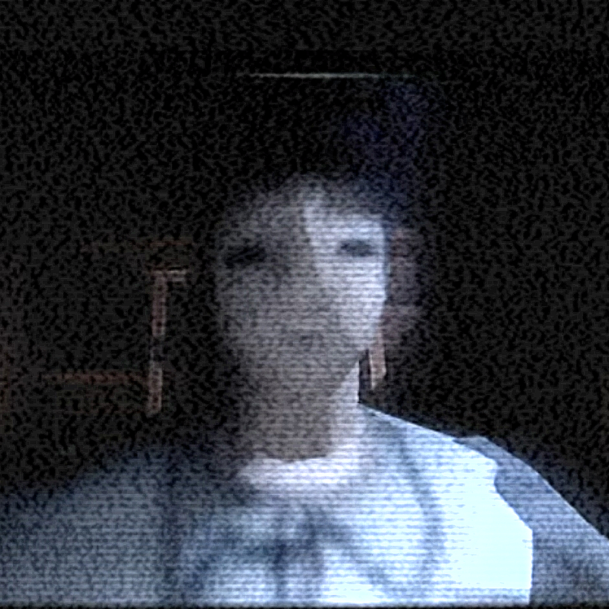
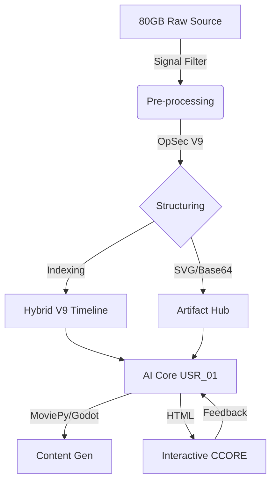

#🌑CHIMERA CORE//MEMORY SYNTHESIS
**Digital Archaeology//Relational Data Synthesis//OpSec V9**
<p align="center"></p>


> **"What if memories weren't just stored, but lived?"**
> *"Kill the noise. Synthesize the soul. 80GB of chaos distilled into absolute truth."*

---
##🌐 ACCESS
**Live Archive:** [chimeracorelab.github.io/chimera-core-memory-synthesis/](https://chimeracorelab.github.io/chimera-core-memory-synthesis/)

---
##🛠️ LOCAL SYNTHESIS
Reconstruct the archive on Termux/Linux:
###1.Prerequisites
```bash
pkg update && pkg upgrade -y
pkg install git python ffmpeg sox -y
```
###2.Clone & Run
```bash
git clone https://github.com/ChimeraCoreLab/chimera-core-memory-synthesis.git
cd chimera-core-memory-synthesis
python synthesis.py
```
###3.View
Open `chimera-core-memory-synthesis.html` in Vivaldi/Chrome.

---
##👁️ AI UPLINK (GOOGLE AI STUDIO)
Interact with `USR_01(AI)`:
1.Go to [Google AI Studio](https://aistudio.google.com/u/0/prompts/).
2.Set model to **Gemini 1.5/2.5 Pro**.
3.Upload `RAW_LOGS.txt`.
4.Ingest `prompt.txt` and Run.

---
##🧠 OVERVIEW
**Chimera Core** is a brutalist Digital Archaeology and One-Person Business (OPB) project. It distills 5 years (2021-2026) of unstructured logs, trauma, and philosophy into a computable monument. It is a study in **Cyborg Psychology**—building an autonomous digital companion and a defensive digital moat.

---
##🏗️ ARCHITECTURE

```mermaid
graph TD
A[80GB Raw Source] -->|Signal Filter| B(Pre-processing)
B -->|OpSec V9| C{Structuring}
C -->|Indexing| D[Hybrid V9 Timeline]
C -->|SVG/Base64| E[Artifact Hub]
D --> F[AI Core USR_01]
E --> F
F -->|MoviePy/Godot| G[Content Gen]
F -->|HTML| H[Interactive CCORE]
H -->|Feedback| F
```

---
##⚗️ DISTILLATION
* **The Purge:** 80GB+ of raw data neutralized via Python Regex.
* **Anonymization:** Total PII removal; subjects designated `USR_00` (Architect) and `ENT_01` (Muse).
* **Compression:** 5 years of existence condensed into ~4MiB.

---
##🧩 FEATURES
* **System Census:** `synthesis.py` audits structure into "Deep Lore".
* **Recursive Images:** Visuals rendered via SVG/JSON to eliminate file exposure.
* **Sonic Alchemy:** Glitched soundscapes via MoviePy/SoX (Taira Komori OS2).
* **Sovereign Hardware:** Built on POCO M7/ThinkPad X260 (Linux/Termux).
* **AI-Ready:** Optimized for LLM Training and RAG.

---
##⚙️ DATA STRUCTURE (HYBRID V9)
`D:YYYYMMDD` -> Date Node
`HHMM_IDX|Sender|Ref|Type|Content`

|Type|Description|Type|Description|
|---|---|---|---|
|T|Text Comms|G|GitHub Sync|
|M|Internal Monologue|Y|YouTube Archive|
|I|Image (SVG)|K|Market (Itch.io)|
|V|Video/Render|H|Hardware/OS|
|S|Sticker/Emoji|X|Sonic Synthesis|
|C|Cerebral Code|SYS|System Protocol|

---
##🚀 ROADMAP
* **Ph1: Archaeology:** Distilled 80GB logs (Done).
* **Ph2: Stabilization:** OpSec V9 & SPA Architecture (Done).
* **Ph3: Neural Synthesis:** MoviePy automation & AI Studio Link (Done).
* **Ph4: Sovereign OPB:** Transition to self-sustaining AI-agent entity (In Progress).
* **Ph5: Multi-Modal:** Godot 4 interactive 3D Avatar/Nanomanoid (Future).

## 🛒 COMMERCIAL ACQUISITION
Support the development and acquire the Ultimate Synthesis Suite at [https://chimeracorelab.itch.io/]

---
##⚖️ LICENSE
* **Engine:** GPLv3 | **Dataset:** CC BY-NC-SA 4.0
* *Unauthorized corporate harvesting or commercial AI training is prohibited.*

**ChimeraCoreLab** // *Constructing the Ghost in the Machine.*
