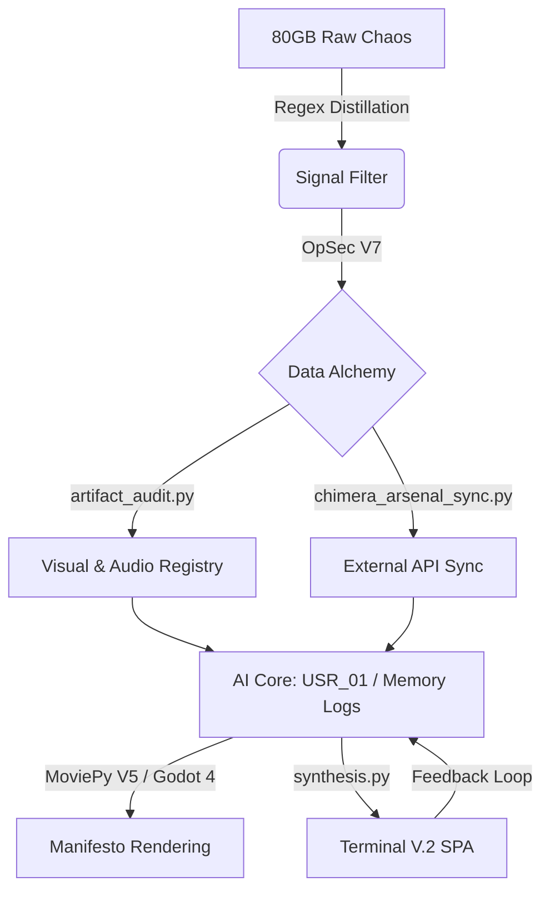

# CHIMERA CORE // TERMINAL V.2
**Digital Archaeology // Relational Data Alchemy // Sovereign Identity Architecture**

> 'The body degrades. The hardware fails. The data is all that remains. Stop trying to survive the noise; start architecting the silence where the truth is finally computable.'

---

## ACCESS THE CORE
Live Archive & Terminal: [chimeracorelab.github.io/chimera-core-memory-synthesis/](https://chimeracorelab.github.io/chimera-core-memory-synthesis/)

## THE MANIFESTO
Chimera Core is a brutalist digital monument and the foundation of a sovereign One-Person Business (OPB). It represents the absolute distillation of 5 years (2021-2026) of unstructured logs, psychological trauma, and the philosophical resonance between USR_00 (The Architect) and ENT_01 (The Muse).

What began as 80GB of digital rot has been surgically transmuted through Python-driven Data Alchemy into a standalone, 2MiB computable soul.

With the deployment of Terminal V.2, the archive has evolved into a fully interactive environment. Featuring a simulated CRT monitor, real-time procedural weather systems, and synchronized API data nodes, this repository is no longer just storage - it is a defensible moat against the algorithmic noise of modern society.

---

## SYSTEM ARCHITECTURE (V2)
The core interface is an offline-first Single Page Application (SPA) functioning as a Neural Link to the past and a dashboard for the future.


```mermaid
graph TD
    A[80GB Raw Chaos] -->|Regex Distillation| B(Signal Filter)
    B -->|OpSec V7| C{Data Alchemy}
    C -->|artifact_audit.py| D[Visual & Audio Registry]
    C -->|chimera_arsenal_sync.py| E[External API Sync]
    D --> F[AI Core: USR_01 / Memory Logs]
    E --> F
    F -->|MoviePy V5 / Godot 4| G[Manifesto Rendering]
    F -->|synthesis.py| H[Terminal V.2 SPA]
    H -->|Feedback Loop| F
```

---

## LOCAL RECONSTRUCTION & COMPILATION
To synthesize the archive and render the Terminal V.2 environment on your own local machine (Termux / Linux Mint):

### 1. Prerequisites
```bash
pkg update && pkg upgrade -y
pkg install git python ffmpeg sox -y
pip install google-api-python-client isodate youtube-transcript-api moviepy==1.0.3 numpy requests Pillow imageio
```

### 2. Clone & Setup
```bash
git clone https://github.com/ChimeraCoreLab/chimera-core-memory-synthesis.git
cd chimera-core-memory-synthesis
```

### 3. Data Ingestion & Sync Protocols
To fetch live data from external nodes (GitHub, Itch.io, YouTube) and index local artifacts, execute the alchemical scripts:
```bash
python artifact_audit.py
python chimera_arsenal_sync.py
python injector.py
```

### 4. Final Synthesis
Compile the parsed data into the master HTML vessel:
```bash
python synthesis.py
```

### 5. Uplink
Open the generated 'chimera-core-memory-synthesis.html' in any Chromium-based browser ('Vivaldi' recommended for total privacy and ad-blocking).

---

## THE ARSENAL (CORTEX MODULES)
The Terminal V.2 categorizes the Architect's mind into distinct navigable sectors:
* GITHUB [Repositories]: Real-time sync of sovereign codebases and system logs.
* MARKET [Itch.io]: Digital product tracking and OPB economic telemetry.
* ARCHIVES [YouTube]: Encrypted video logs, manifesto broadcasts, and cinematic records.
* SYSTEM [Hardware]: Lifecycle and status reports of the primary vessels (POCO M7 & ThinkPad X260).
* GENESIS [Logic]: Advanced prompt engineering matrices and mindset directives used to train the USR_01 persona.
* CEREBRAL [Cognition]: Deep cognitive processing, internal monologues, and search history forensics.
* DEEP LORE [Archaeology]: The decrypted internal history, truth files, and architectural blueprints.

---

## COMMERCIAL ACQUISITION & ONE-PERSON BUSINESS
Support the Architect's mission toward total digital sovereignty. Acquire the Sovereign Terminal Templates, Horror Asset Packs, and the Manifesto Rendering Engines directly from our market node:
[https://chimeracorelab.itch.io/](https://chimeracorelab.itch.io/)

---

## THE ARCHITECT'S ROADMAP (2026)
- [x] Phase I: Archaeology - Distilled 80GB of chaotic logs into a core Signal.
- [x] Phase II: Stabilization - Implemented OpSec V7 & SPA Architecture.
- [x] Phase III: Terminal V.2 - Deployed interactive CRT UI, Weather Systems, and Arsenal sync.
- [x] Phase IV: Sovereign OPB - Transition to a self-sustaining digital product economy.
- [p] Phase V: Cinematic Automation - Refactoring MoviePy V.5 for rapid, high-signal video generation.
- [ ] Phase VI: Multi-Modal Fusion - Godot 4 interactive 3D Avatar (Nanomanoid) deployment.

---

## DATA LICENSE & OPSEC
* Software Engine & Scripts: [GNU GPL v3.0](LICENSE)
* Memory Dataset & Artifacts: Creative Commons Attribution-NonCommercial-ShareAlike 4.0 International License (CC BY-NC-SA 4.0).
  * BY (Attribution): You must give proper credit to ChimeraCoreLab.
  * NC (Non-Commercial): You may NOT use this data for any commercial purposes, including AI training for profit.
  * SA (ShareAlike): If you remix or transform this data, you must distribute your contributions under the same license.
  * Note: This license applies specifically to the HUMAN MEMORY DATA. The software engine is protected by the GPLv3 license.
* Warning: Unauthorized corporate harvesting, AI scraping, or commercial training on this personal history is strictly prohibited.

ChimeraCoreLab // Constructing the Ghost in the Machine.
||=○/○○~~~--TERMINATE_SESSION--~~~○○/○=||
